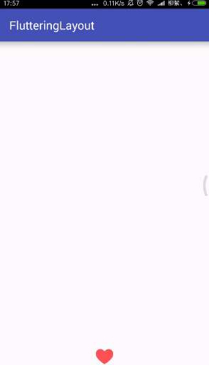

# FlutteringLayout
[](https://raw.githubusercontent.com/jenly1314/FlutteringLayout/master/app/app-release.apk)
[](https://jitpack.io/#jenly1314/FlutteringLayout)
[](https://opensource.org/licenses/mit-license.php)
[](http://blog.csdn.net/jenly121)

FlutteringLayout for Android 一个直播间点赞桃心飘动效果的控件。

## Gif 展示


## 引入

### Maven：
```
<dependency>
  <groupId>com.king.view</groupId>
  <artifactId>flutteringlayout</artifactId>
  <version>1.1.0</version>
  <type>pom</type>
</dependency>
```
### Gradle:
```
compile 'com.king.view:flutteringlayout:1.1.0'
```
### Lvy:
```
<dependency org='com.king.view' name='flutteringlayout' rev='1.1.0'>
  <artifact name='$AID' ext='pom'></artifact>
</dependency>
```
###### 如果Gradle出现compile失败的情况，可以在Project的build.gradle里面添加如下：（也通过可以使用上面的GitPack来complie）
```gradle
allprojects {
    repositories {
        maven { url 'https://dl.bintray.com/jenly/maven' }
    }
}
```

## 示例

布局
```Xml
    <com.king.view.flutteringlayout.FlutteringLayout
        android:id="@+id/flutteringLayout"
        android:layout_width="match_parent"
        android:layout_height="match_parent"
        android:layout_marginBottom="10dp"
        app:duration="3000"
        app:enter_duration="300"
        app:scale="1.0"/>
```

添加桃心代码
```Java
flutteringlayout.addHeart();
```

## 关于我
   Name: Jenly

   Email: jenly1314@gmail.com / jenly1314@vip.qq.com

   CSDN: http://blog.csdn.net/jenly121

   Github: https://github.com/jenly1314

   微信公众号:

   
